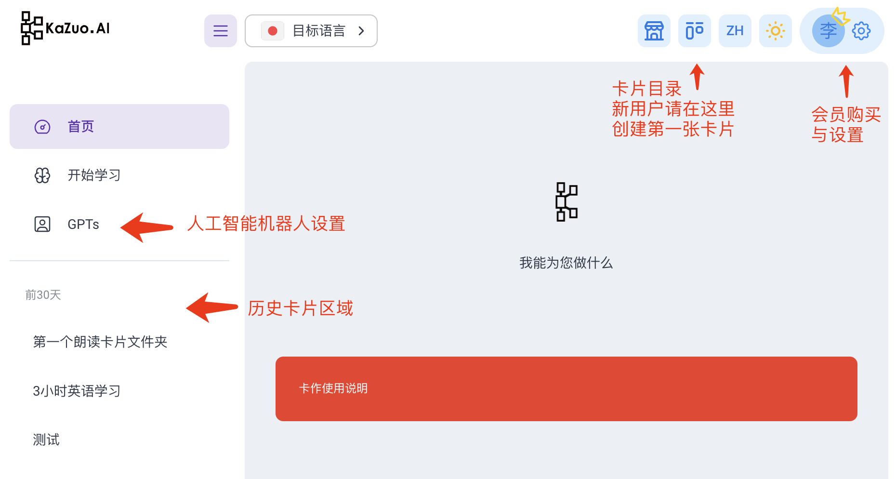
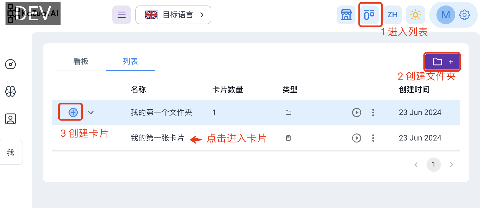
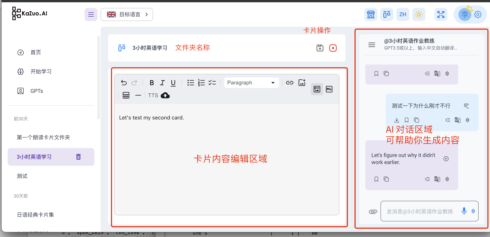
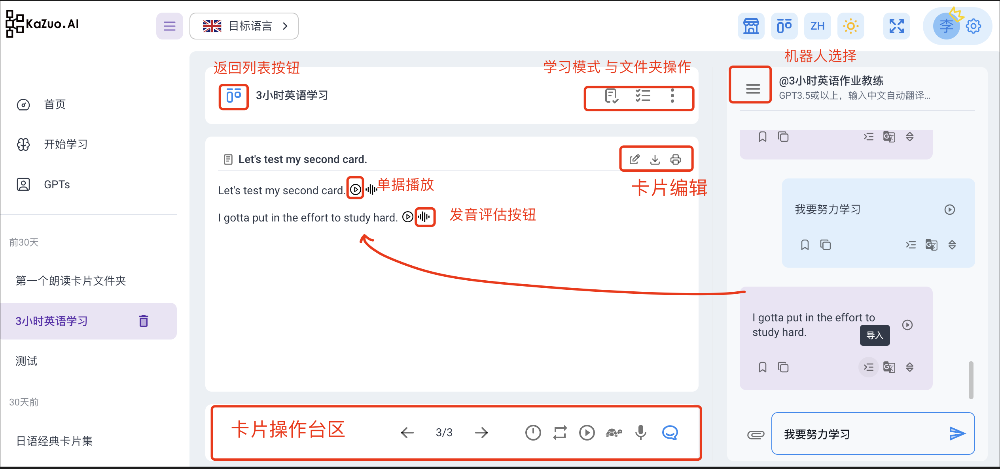
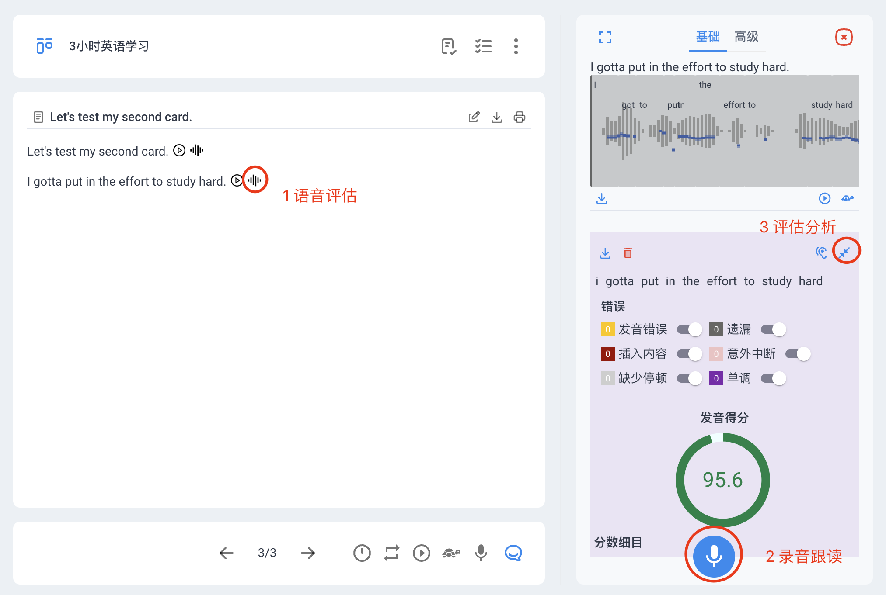

# 1000小时英语学习

卡作（kazuo.ai）的定位是基于AI增强的卡片记忆学习工具  
因为部分社群小伙伴有一些现实困难，比如：  
1网络设置 2 配置困难 3 移动端的使用需求  
因此，为已经付费的用户增加了很多朗读英语功能支持  
也通过这个过程形成了“**[多模态卡片](../tutorial-basics/multi-modal.md)**”等创新功能   
感谢笑来老师的1000学习方法论：https://1000h.org/  
从开始到现在，终身受益  
接下来，kazuo迈向新的里程碑   

## 开始使用

以下，为做好新老学员的衔接，  
从“多模态”卡片的角度，来讲解如何完成每日3小时英语学习：

一、从首页点击“开始使用”进入，然后点击右上角“卡片目录”：  

二、先创建文件夹、再创建自己的第一张卡片：

三、创建自己希望朗读的内容：

## 学习内容

把你想说的英语朗读内容，放到卡片内，有两种方式：  
方式1: 直接编辑卡片内容  
方式2: 通过机器人生成内容：   
1）选择”3小时英语作业教练“机器人  
2）直接输入中文后，机器人自动帮你翻译成英文  
3）点击导入按钮，内容直接在卡片出现

  

如图所示，我们来介绍几个区域的功能    
1）最中间为卡片区域，是我们沉淀内容与知识的基础区域，每句话后有 **[发音评估](../tutorial-basics/multimodal.md)** 按钮   
2）卡片下方有操作按钮，可以切换卡片，调整播放模式等  
3）卡片上方可以选择卡片学习的模式，或者编辑卡片等  
4）卡片的右侧为AI对话框，具备：让AI帮你生成内容，导入到卡片，词典，翻译等功能  
5）点击评估后，对话框会呈现发音评估的界面，详情如下

## 开始学习

当卡片内容录入成功，卡片会自动生成AI合成语音  
点击播放按钮即可反复收听 *支持手机端锁屏播放

如图所示，  
1）当你点击评估按钮，右侧出现评估界面  
2）开始录音，根据原文朗读即可  
3）点击评分按钮，AI会帮助你分析问题  
* 高级评功试运行中，可以按照单词评估语调  

