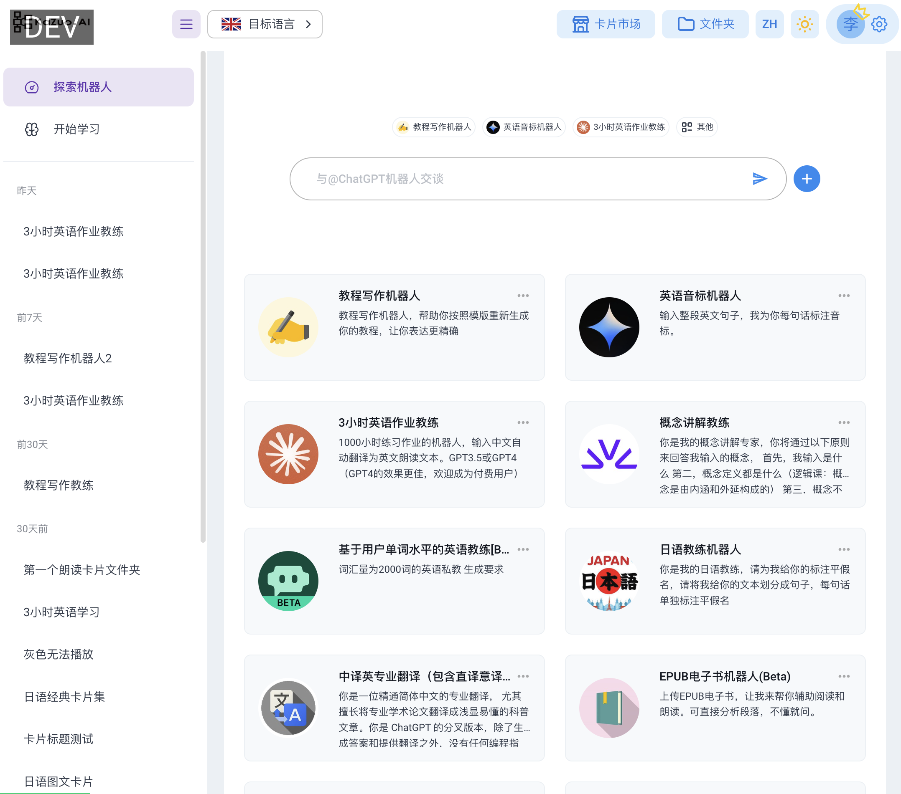
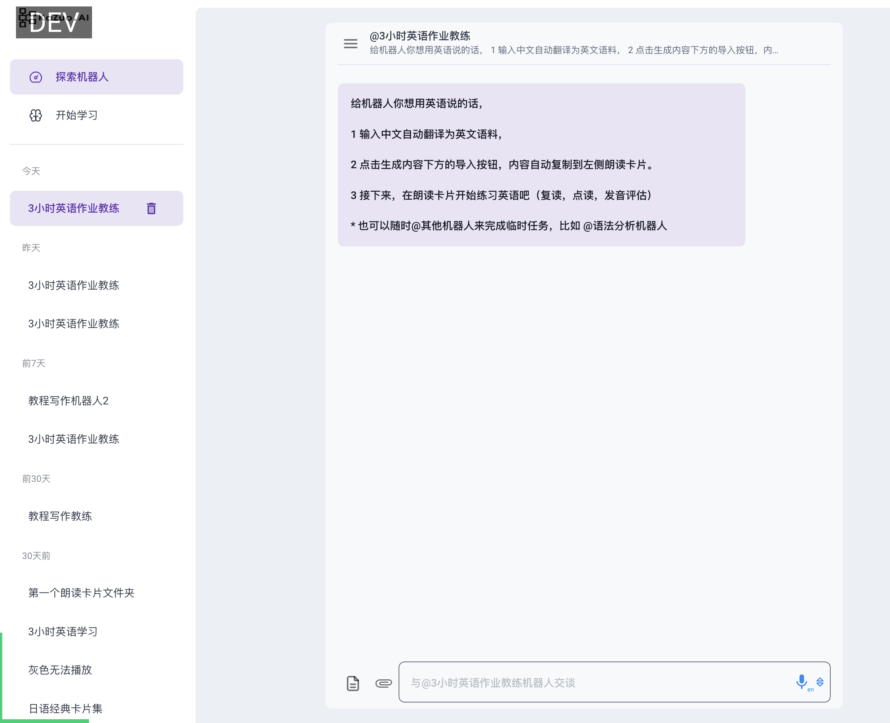
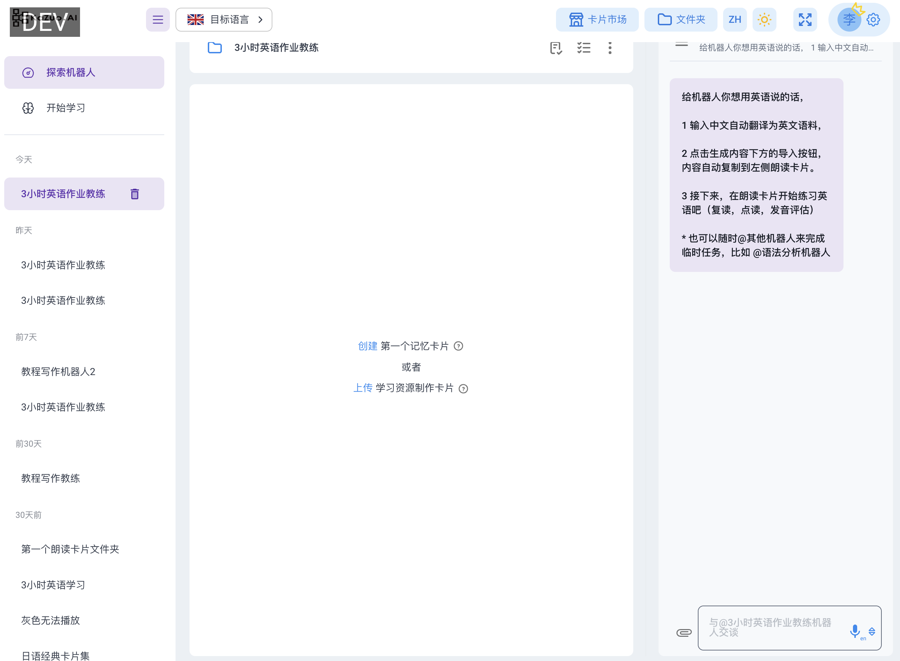
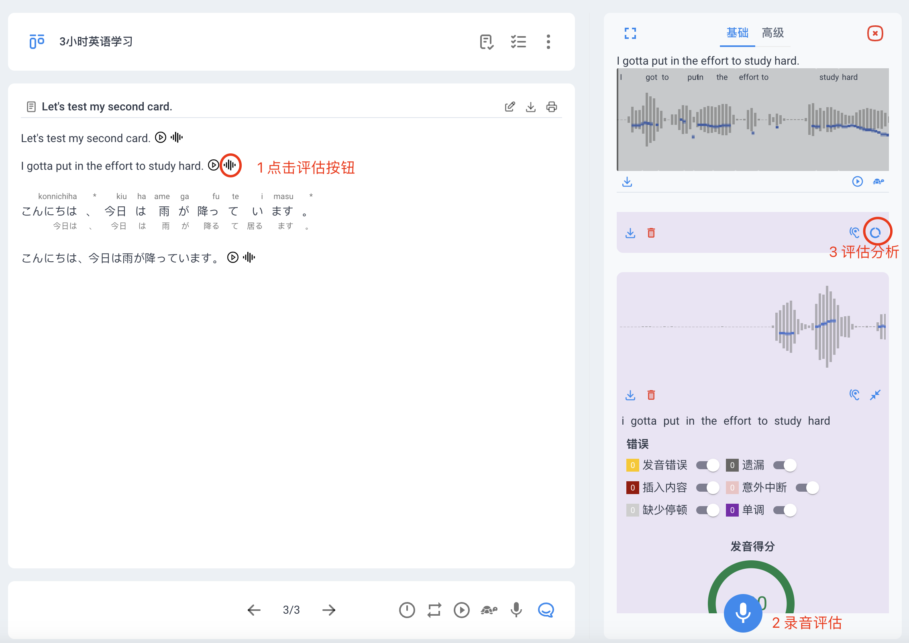
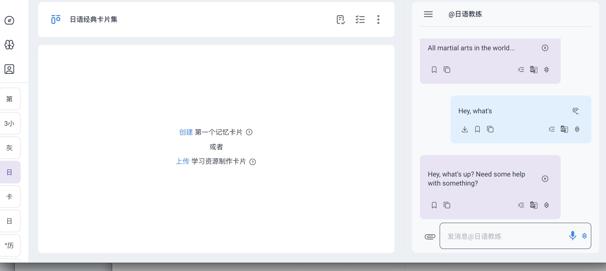
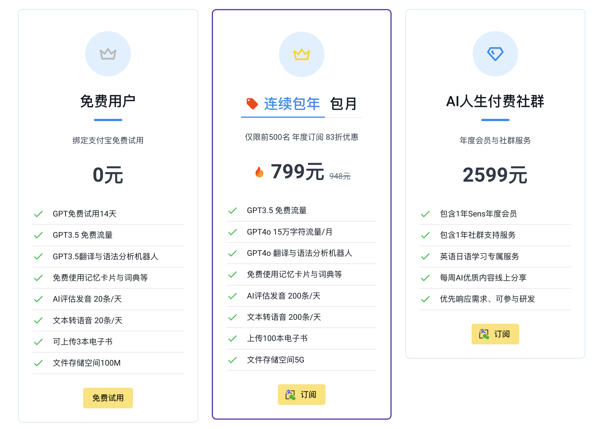

# 开始使用

KaZuo.ai Logo将在8月份切换至Sens（深思）  
新增域名 www.ssenss.com  
老域名 www.kazuo.ai 照常使用  

文档更新可能落后于实际功能，任何问题可在大群询问。  
更新日期 2024-7-4

## 探索机器人

[注册成功后](https://www.ssenss.com/signup?invitation=UJpaZN) ，在首页点击开始使用

一、导航进入探索机器人：

可以直接发消息给你需要的机器人

二、选择你需要的机器人，可以直接与它交谈：  
<!--  -->
    

点击上图附件旁边的卡片按钮，可以展开一个类似“记事本”的卡片， 这就是我们核心的多功能卡片，如下图

三、创建自己希望朗读的内容：

## 学习内容

把你想说的英语朗读内容，放到卡片内，有两种方式：  
方式1: 直接编辑卡片内容  
方式2: 通过机器人生成内容：   
1）选择”3小时英语作业教练“机器人  
2）直接输入中文后，机器人自动帮你翻译成英文  
3）点击导入按钮，内容直接在卡片出现

  

如图所示，我们来介绍几个区域的功能    
1）最中间为卡片区域，是我们沉淀内容与知识的基础区域，每句话后有 **[发音评估](../tutorial-basics/pronunciation.md)** 按钮   
2）卡片下方有操作按钮，可以切换卡片，调整播放模式等  
3）卡片上方可以选择卡片学习的模式，或者编辑卡片等  
4）卡片的右侧为AI对话框，具备：让AI帮你生成内容，导入到卡片，词典，翻译等功能  
5）点击评估后，对话框会呈现发音评估的界面，详情如下

## 开始学习

当卡片内容录入成功，卡片会自动生成AI合成语音  
点击播放按钮即可反复收听 *支持手机端锁屏播放

如图所示，  
1）当你点击评估按钮，右侧出现评估界面  
2）开始录音，根据原文朗读即可  
3）点击评分按钮，AI会帮助你分析问题  

 #### 特别提示 

 * 根据左上角目标语言，可以分析评估的语种分别为：日语，英文，与中文
 * 选择目标语言后，朗读卡片就自动支目标语言的评估，所有设置仅支持目标语言
 * 禁止在微信内直接登录，会造成需要反复登录、功能不稳定等问题
 * **[请使用原生浏览器，并授权麦克风权限 ](../tutorial-extras/other.md)** ，点击查看

 #### 高级  
 * 高级评估试运行中（内测到2024.7.31结束）
 * 高级评估的标准更加严，很难高分
 * 可单独评估单个单词
 * 可评估语音语调（轻重音的错误）
 * 高进评估仅支持英语  

##### 也可以通过顶部导航文件夹中、创建自己的卡片：

# 大家加油学习，欢迎来打卡群提问  
可使用内测邀请码试用    
https://www.ssenss.com/signup?invitation=UJpaZN  
目前付费版本支持GPT4o，反应速度更快，回答逻辑性更强，还支持图片识别等功能。  
欢迎大家 **[付费使用](../tutorial-basics/payment.md)** 获得更多功能 

##### 2024.05.29公告：
旧版本www.kazuo.app会继续运行下去  
1 旧版朗读卡片 会同步到新版本 “*历史朗读卡片集合”中  支持双向修改  
   旧版增加新卡片 会同步到新版 （新版本增加卡片不会同步到旧版）  
2 新旧版本区别   
  1）朗读卡片 记忆卡片 阅读卡片三合一  
   新版本记忆卡片需要上传新的电子书作为记忆卡片的附件 制作各种学习卡  
  未来视频 网址 都可以作为卡片制作的素材  
  （目前新版支持照相和图片识别来制作卡片）  
3 新版www.ssenss.com会有APP的ios和android版本和(旧版本仅支持web，手机web端)
 

