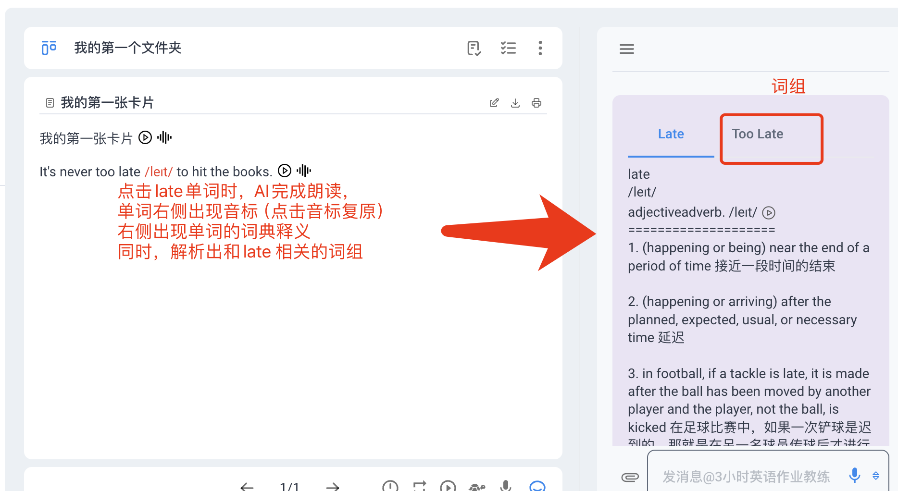
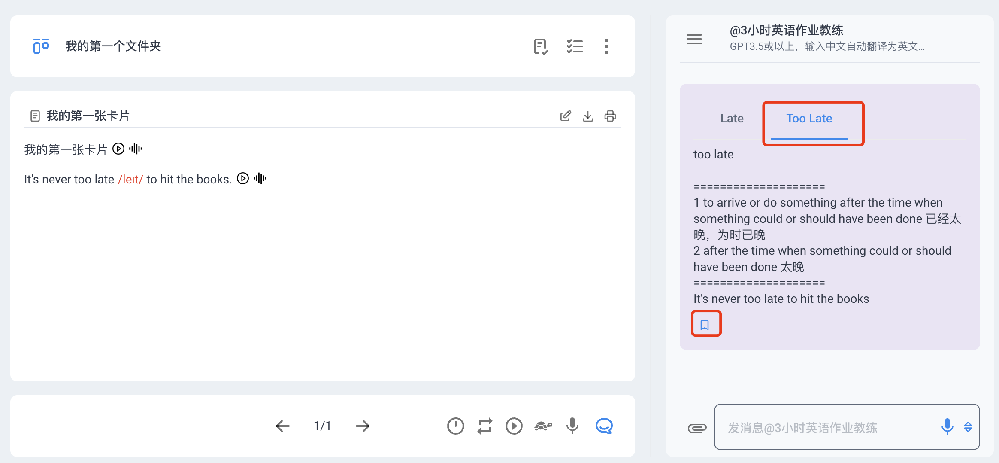
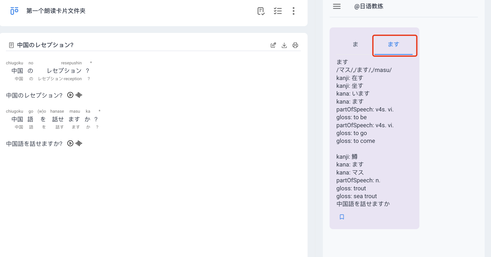

# 智能词典介绍

### 基本的词典功能  

1 可以在左侧卡片中直接点击单词  
2 点击后右侧自动弹出词典释义与分析出的词组  
3 可点击词组可以查看其释义  

*这里的“词组”等同：短语、固定搭配（Phrase）等

### 智能分短语、词组的功能  

*点击收藏可以把单词和生成加入生词本，生词本同样支持艾宾浩斯遗忘曲线*
### 日语词典的支持

日语的分词功能，如下所示

