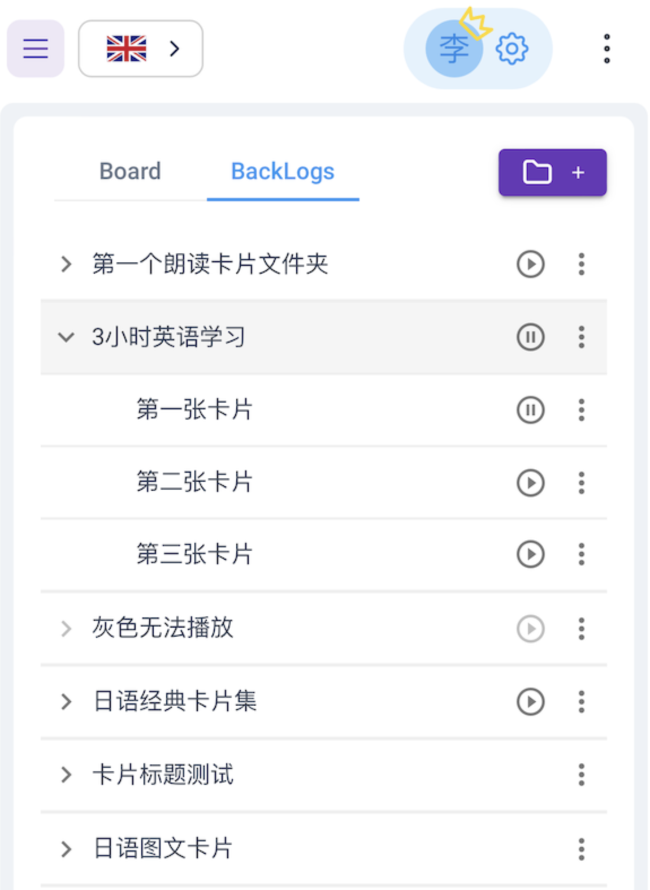

# 移动播放器

## 卡作的播放器功能    
可以把卡作（KaZuo.AI）当做一个 **“可自定义内容”**的 **“手机播放器”** (桌面浏览器的播放也没问题)

如图所示，点击播放按钮，图中的三张卡都会被逐一朗读，从上到下。  
所以你可以编辑任何内容，随时随地，反复收听。  
比如，每天健身房，或者徒步回家的时候，或者在地铁、飞机上   
*无网络环境需至少播放过一次，让音频离线下载完成*

可以在锁屏状态下播放，边走边听

#### 另外，每张卡片都可以在列表目录中随意拖动顺序，或者拖动到其它文件夹  

## 操作注意事项  

* 播放按钮灰色证明无法播放，可能是因为没有卡片内容  
* 老系统同步过来的Anki卡片无法播放  
* AI语音生成需要耗费OpenAI token，价格不菲，请勿大幅复制电子书等大量文字到朗读卡片
* 如果需要电子书阅读，可上传Epub电子书，使用卡作的阅读功能
