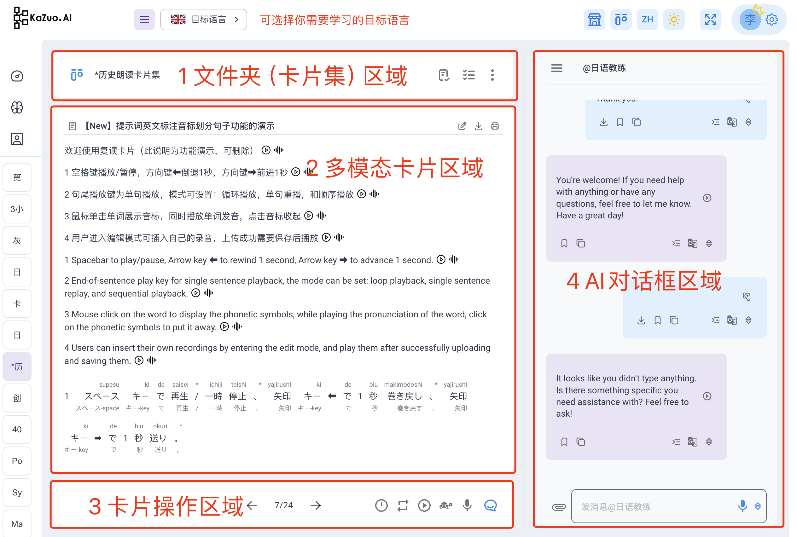

# 多模态卡片

比“多功能”可以用“多模态“这个流行词替换

因为每张卡片都为用户“听”，“说”，“读”，“写”，“记”等功能  

基于ChatGPT增强的记忆卡片：  
实现了 “电子书”+“记忆卡片”+“朗读评估” = 三合一多模态卡片

### **【记】1 文件夹区域**   

1） 记忆模式：利用遗忘曲线帮你记忆当前卡片集合中的每个卡片（卡片内容不易过多）  
2） 快速排查：另一种列表样式的记忆模式，可以快速复习学习过的单词  
3） 可以随时添加卡片或删除卡片

### **【听】2 多模态卡片区域**   

解决用户所有听与学的需求：  
1）卡片会说话，所有内容AI可自动朗读，无论男女，英文还是日文；  
2）同时内容可以通过AI生成，通过4 AI对框内的各种机器人，也可自动录入；  
3）支持 **[点读与复读](../tutorial-basics/tap-reader-repeater.md)** ，点击单词弹出音标与词典释义，提供一站式学习服务；    
4）支持 **[发音评估](../tutorial-basics/pronunciation.md)** ，学完就练，看看AI能给多少分；  
5）独有的TTS标签，在编辑内容时使用，可以只让AI读取含有[tts:]的内容，适合作各种点读卡片；  
6）可以下载卡片内容生成的音频，或者打印出纸质版本；  
7）快捷键：音频播放时，通过方向键快进或后退，方便重复收听；空格快捷键暂停或者播放；  

### **【读】3 卡片播放区域**  

1）这里的方向按钮可以浏览文件夹中的每一张卡片 7/24 代表总共24张卡片的第7张卡片  
2）控制台负责AI“读”卡片播放模式，实现 **[复读机](../tutorial-basics/tap-reader-repeater.md)** 全部功能，时间间隔，播放模式与龟速播放  
3）同时支持自己的录音即时上传； （自定义MP3上传功能正在开发中，敬请期待）
4）此区域在记忆模式下会显示答案按钮   

### **【写】4 AI对话框区域**  

#### 第一大核心功能区域，集成众多AI科技，从上倒下讲解：  

1）对话框左上角可设置各种一个默认机器人：3小时英语教练，音标教练，词典，日语教练，写作机器人等  
   默认机器人代表：无需每次@机器人，直接录入，就是与默认机器人对话  

2）虽然设置了默认机器人，最下方的对话框仍然可以临时@其它任何机器人，输入@体验下吧？  

3）中间部分是对话气泡，每个气泡都具备很多功能：   

 -    3.1）音频下载功能，随时下载用户或者AI的音频；  
 -    3.2）复制按钮，也可以鼠标右键单击，气泡内容会自动进入输入框；  
 -    3.3）靠右的导入按钮，可以把气泡内容导入到左边的卡片中；  
 -    3.5）翻译按钮与选择语言按，分别负责翻译该语言与选择目标语言；  

4）输入框功能介绍：  

 -    4.1）附件上传，可以上epub电子书，自动进入电子书阅读模式  
 -    4.2) 附件上传图片，让GPT4o为你提取文字，比很多图片ORC工具要好用（仅付费用户使用）  
 -    4.3) 语音录入，任何语言直接录音即可识别，可直接口语机器人对话  
    （近期上线，着急的用户可以自己先配置一个）  
 -    4.4) 想提高语音精准度，可以点击上下箭头选择目标语言  
    （提高稳定性后，可以长时间录音记录会议纪要）
 -    4.5） 可以临时@某个机器人，完成各类任务，参考2）

5） 输入框区域也是发音评估 **[发音评估](../tutorial-basics/pronunciation.md)**  区域，请点击了解
