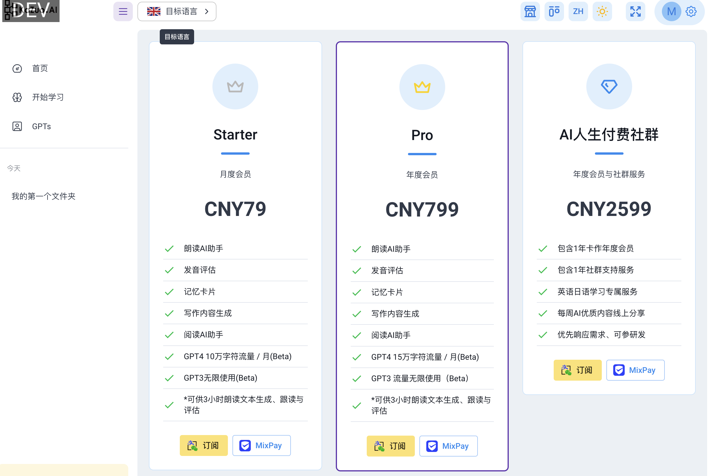
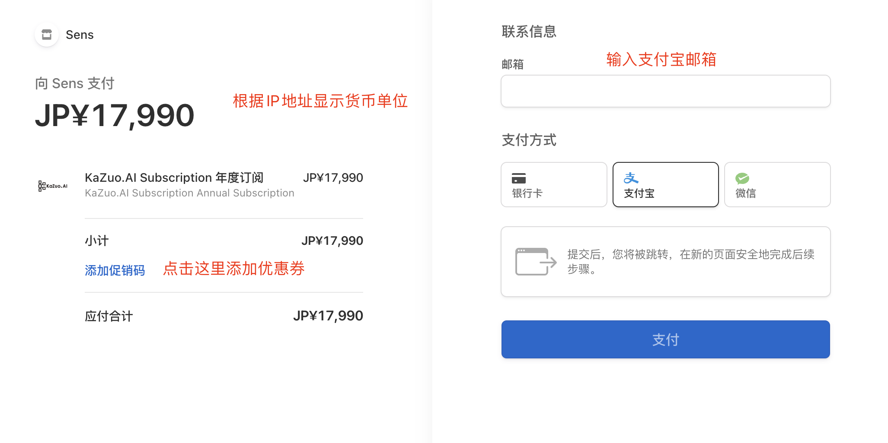
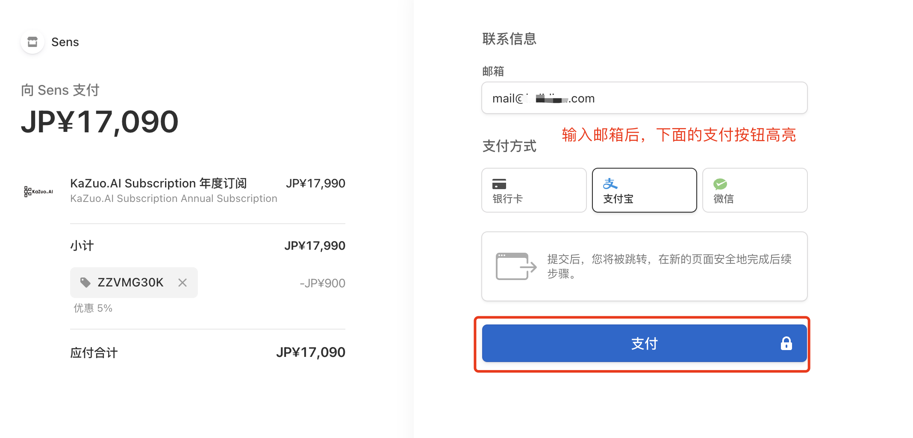
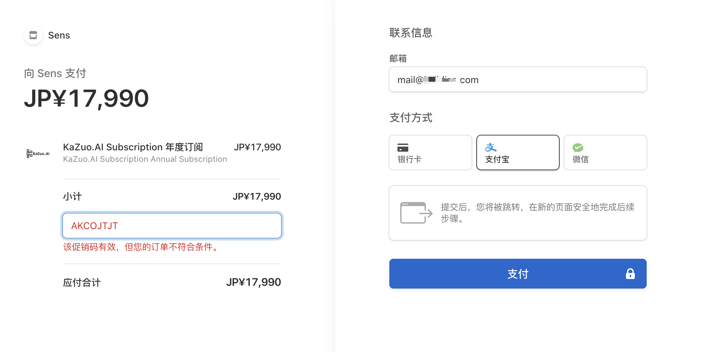
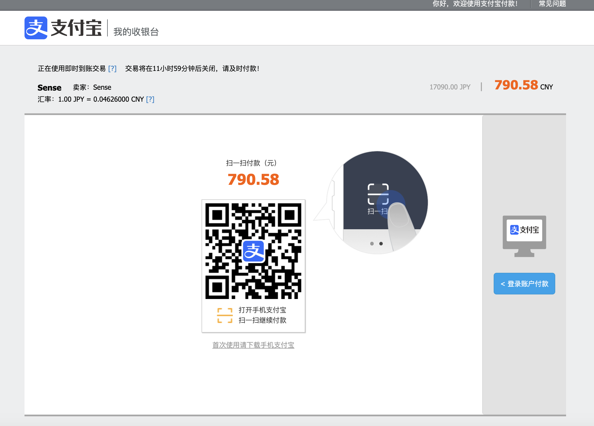

# 订阅与优惠

## 订阅付费的优势

#### 1 目前付费版本支持GPT4o，反应速度更快，回答逻辑性更强。  
GPT4逻辑性强代表：  
1) 机器人回答语法问题，合理性更高，相比GPT3，更加严谨，不容易出错；  
2）GPT4在生成内容方面更加出色，帮你生成地道的学习材料；  
3）图片识别，文字提取等功能，你可以试试拍摄英文资料，让GPT4o帮你提取；  

#### 2 付费用户的发音评估    
1）免费用户每天仅可以使用20条发音评估；  
2）对于重视朗读发音的用户，可能需要更多的使用次数；  

#### 3 付费用户更多的存储空间  
1）免费用户仅能上传20M的图片或者EPUB电子书；  
2）付费用户可以上传100M的图片或者EPUB电子书；  
3）免费用户的存储空间为100M，付费用户为1G空间（空间显示开发中，敬请期待）；  

<!-- ## 数字货币支付  

7月份，我们会对店主货币支付的用户进行优惠，10%～20%不等，活动期限以 -->

*目前微信只支持在PC端付款，手机扫码请用支付宝。

*微信支付只支持一次性付款，不支持周期性订阅，不享受优惠。

*使用支付宝享受包月优惠，包年优惠20%以上 （12个月的使用期限，付10个月的价格）  

## 优惠券的使用方式  

订阅页面点击订阅按钮后：    

需要输入支付宝邮箱：  

下图为优惠码过期，请重新索取优惠码：  

支付宝扫码支付即可：

