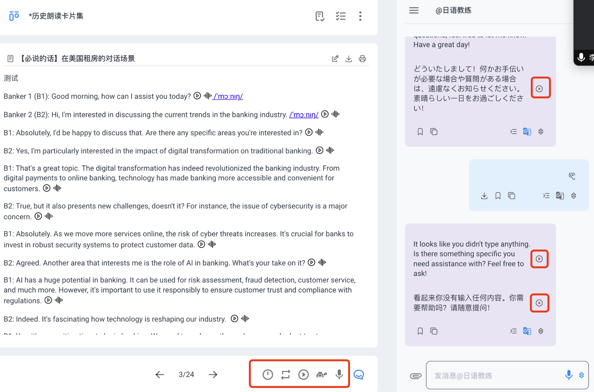

# 复读机的场景

## 多模态卡片的复读功能

除了点击卡片中的播放按钮与评估按钮，反复听AI朗读或评估你的发音  
卡作，还为你批量朗读，提供了播放器的全部功能：  

朗读卡片下方的操作台，从左到右依次为：  

1 **播放间隔设定：** 当需要设定卡片中每句话播放的播放间隔时，可点击该按钮改变，  
   每次单击改变播放间隔（1s,3s,5s,10s），可用于学生的英语听写作业场景  

2 **播放模式：** 可以设置卡片全部句子的循环播放，单局重复播放，和正常播放（只播放一次）

3  **卡片播放按钮：** 是全局播放按钮，当你需要完整的收听卡片全部句子时，可以点击该播放按钮

4  **慢速播放：** 当AI发音语速过快，可以点这个按钮进行播放，大概是原始速度的0.8倍（受限于播放质量可能无法更低）

5  **录音插入按钮：** 可以把自己的录音插入到朗读卡片中存档

6 **对话框按钮：**  当你需要更大的展示空间的时候,可用于关闭右侧对话框

7  **音频上传按钮：** 上传自己的音频课程 （开发中）

*可以注册右侧对话框也有播放按钮，当你需要学习AI生成的内容或者翻译的时候，可以点击右侧播放按钮
*或者点击导入按钮，写入到卡片中。